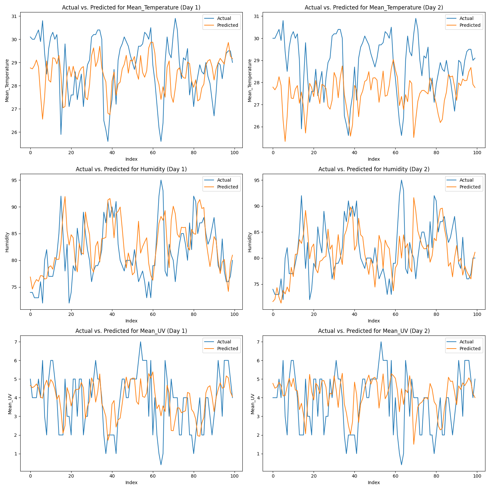
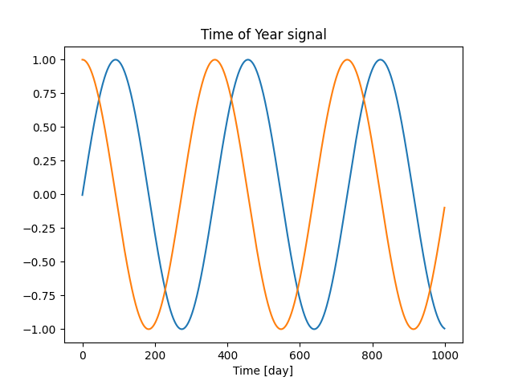
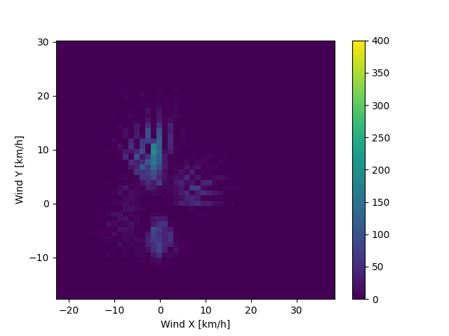
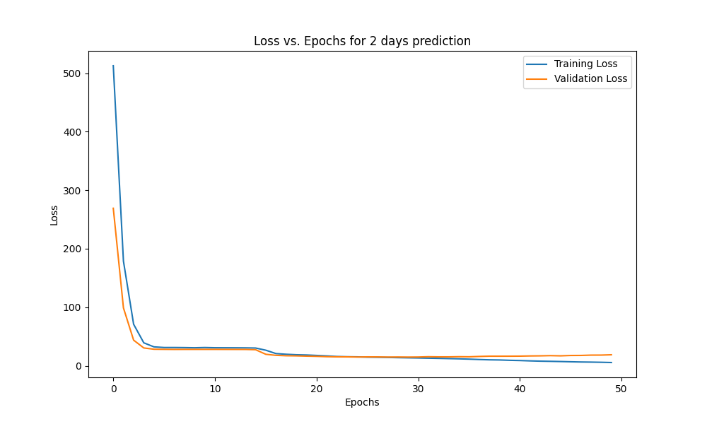
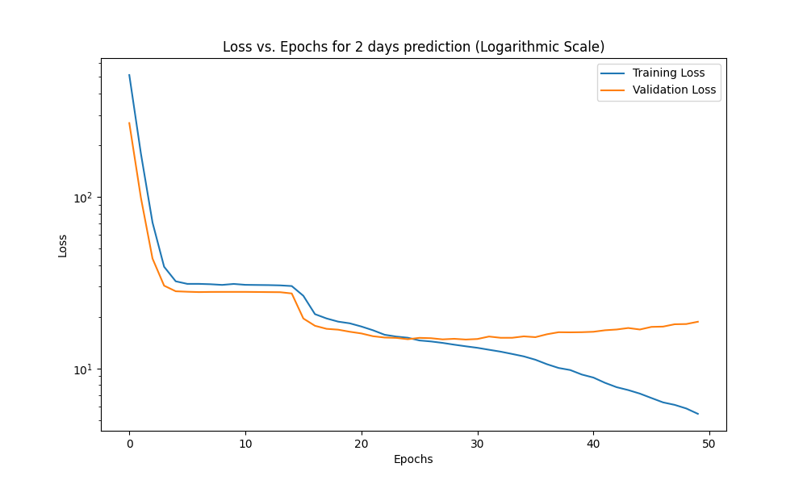

# Deep-Learning-for-Meteorological-Forecasting
Deep Learning for Meteorological Forecasting: Advanced Weather Prediction Using LSTM Networks


     
## Table of Contents


     
1. [Overview](#overview)
2. [Data Collection](#data-collection)
   - [Data Sources](#data-sources)
   - [Error Resolution](#error-resolution)
3. [Data Cleaning for LSTM](#data-cleaning-for-lstm)
   - [Datetime Indexing](#datetime-indexing)
   - [Cyclical Feature Encoding](#cyclical-feature-encoding)
   - [Wind Vector Calculation](#wind-vector-calculation)
   - [Data Splitting](#data-splitting)
4. [Model Development](#model-development)
   - [Input and Output Arrays](#input-and-output-arrays)
   - [Standardization](#standardization)
   - [Loss Functions](#loss-functions)
5. [Results and Evaluation](#results-and-evaluation)
6. [Installation](#installation)
7. [Contributing](#contributing)
8. [License](#license)
9. [Contact](#contact)

## Overview
This project implements a weather prediction model using Long Short-Term Memory (LSTM) networks. The model forecasts weather conditions such as temperature, humidity, and UV index based on historical data, spanning from 2000 to 2023. To increase the accuracy of the analysis all collected datasets are based on location, which is King's Park in Hong Kong. 

Since first I did this project for the purpus of learning some years ago, many different model and archituctures are tried, so my goal is to gather all experiences in case someone wants to use this repo for the purpus of learning.

I decided  to predict weather conditions such as temperature, humidity, and UV for future days based on the historical data as LSTM is particularly well-suited for this application because it can learn the complex patterns in the weather data over time and make accurate predictions. To framing input sequences I organised the historical weather data into sequences of a fixed length, which will serve as the input to the model. For example, a sequence length of 7 days is chosen, meaning that the model will use the weather data from the past 7 days to predict the weather for the next few days(1 or 2 or 4 days). 
The output sequences represent the predicted weather conditions for the coming days (1 or 2 or 4) and will contain the predicted values for temperature, humidity.


## Data Collection
The dataset for this project is collected from various sources available on the Hong Kong government data portal and CSDI website. The datasets include:
The `Date` column was created by combining the `year`, `month`, and `day` columns into a single datetime object, which serves as the primary key for merging datasets.

### Data Sources
1. Daily mean amount of cloud      [Link to Hong Kong Government portal](https://data.gov.hk/en-data/dataset/hk-hko-rss-daily-mean-amount-of-cloud)
2. Daily total bright sunshine     [Link to Hong Kong Government portal](https://data.gov.hk/en-data/dataset/hk-hko-rss-daily-total-bright-sunshine )
3. Daily total evaporation         [Link to Hong Kong Government portal](https://data.gov.hk/en-data/dataset/hk-hko-rss-daily-total-evaporation)
4. Daily global solar radiation    [Link to Hong Kong Government portal](https://data.gov.hk/en-data/dataset/hk-hko-rss-daily-global-solar-radiation)
5. Daily mean relative humidity    [Link to Hong Kong Government portal](https://data.gov.hk/en-data/dataset/hk-hko-rss-daily-mean-relative-humidity)
6. Daily mean pressure             [Link to Hong Kong Government portal](https://data.gov.hk/en-data/dataset/hk-hko-rss-daily-mean-pressure )
7. Daily prevailing wind direction [Link to Hong Kong Government portal](https://data.gov.hk/en-data/dataset/hk-hko-rss-daily-prevailing-wind-direction)
8. Daily total rainfall            [Link to Hong Kong Government portal](https://data.gov.hk/en-data/dataset/hk-hko-rss-daily-total-rainfall)
9. Daily maximum mean UV index     [Link to Hong Kong Government portal](https://data.gov.hk/en-data/dataset/hk-hko-rss-daily-maximum-mean-uv-index)
10. Daily mean wind speed          [Link to Hong Kong Government portal](https://data.gov.hk/en-data/dataset/hk-hko-rss-daily-mean-wind-speed)

### Error Resolution
Errors were encountered due to incorrect date values in some datasets. The problematic `df_mean_pressure` DataFrame was identified, and entries outside the valid date range (2000-01-01 to 2023-12-31) were removed.

If you try to work with individual datasets rather than the cleaned one, you will encounter many issues that need to address, but one of them is 

I encountered errors due to incorrect date values in some rows. It appears that the issue lies in one of the data frames where a month has more rows than it should, such as having 30 rows for a 29-day month. To resolve the issue, I need to identify the problematic data frame and correct the problem.
Since there are 14 datasets with over 300,000 rows in total, I believe it would be more efficient to create the date column for each data frame individually as below (The snipped code picture is removed due to limitation in length snipped code 87 to 94). Finally I realised that data frame "df_mean_pressure" has the problem, below I will try to remove the early month as possibly they have the problems. In the stage I want just keep the data points from ` 2000-01-01` to `2023-12-31`, so I will do as below:


## Data Preprocessing 

### Datetime Indexing
The `Date` column was converted to a datetime object and set as the index, while the original `Date` column was dropped.

### Cyclical Feature Encoding
New columns representing the cyclical nature of time (`Year sin` and `Year cos`) were created to help the model understand seasonal patterns, which is essencial for for time series prediction.

```pyton
df = pd.read_csv("Weather_HK_00.csv")
df.index = pd.to_datetime(df['Date'], format='%Y-%m-%d')   # Handel the column Date
df = df.iloc[:,1:]  # We do not need the column date any more
df['Seconds'] = df.index.map(pd.Timestamp.timestamp)

# Convert column date to 2 new columns 'Year sin' and 'Year cos'
day  = 24*60*60
year = (365.2425)*day
df['Year sin'] = np.sin(df['Seconds'] * (2 * np.pi / year))
df['Year cos'] = np.cos(df['Seconds'] * (2 * np.pi / year))
df = df.drop('Seconds', axis=1)  # We do not need column "Seconds" any more
```


### Wind Vector Calculation
Wind direction was transformed into x and y components (`mean_wind_x` and `mean_wind_y`) to improve the input representation of wind data.

```python
# Calculate the max wind x and y components.
df['mean_wind_x'] = mean_wind_speed*np.cos(wind_direction_rad)
df['mean_wind_y'] = mean_wind_speed*np.sin(wind_direction_rad)
```

```python
plt.hist2d(df['mean_wind_x'], df['mean_wind_y'], bins=(50, 50), vmax=400)
plt.colorbar()
plt.xlabel('Wind X [km/h]')
plt.ylabel('Wind Y [km/h]')
ax = plt.gca()
ax.axis('tight')
plt.savefig('wind_x_y.png', format='png')
plt.show()
```


### Data Splitting
The dataset was divided into training (70%), validation (20%), and test (10%) sets for effective model training and evaluation.

## Model Development

### Input and Output Arrays
The `df_to_X_y` function was utilized to convert the DataFrame into input (X) and output (y) arrays, using a window size of 7 or 14 days to predict the next 1, 2, or 4 days of weather.

For Example,in the snipped code below predict the next 2 days.
```python

def df_to_X_y_days(df, window_size=7):
    df_as_np = df.to_numpy()
    X = []
    y = []
    for i in range(len(df_as_np) - window_size - 1):  # Subtract 1 to account for the extra day in prediction
        row = [r for r in df_as_np[i:i + window_size]]
        X.append(row)
        label_day_1 = [df_as_np[i + window_size][2], df_as_np[i + window_size][6],
                       df_as_np[i + window_size][11]]
        label_day_2 = [df_as_np[i + window_size + 1][2], df_as_np[i + window_size + 1][6],
                       df_as_np[i + window_size + 1][11]]
        label = label_day_1 + label_day_2  # Combine the labels for both days
        y.append(label)
    return np.array(X), np.array(y)
X_days, y_days = df_to_X_y_days(df)
X_days_train, y_days_train = X_days[:6000], y_days[:6000]
X_days_val, y_days_val = X_days[6000:7800], y_days[6000:7800]
X_days_test, y_days_test = X_days[7800:], y_days[7800:]
```

### Standardization
Features were standardized using the mean and standard deviation calculated from the training dataset, excluding cyclical features and wind vector components. Just be careful to normalize the eveluation and test dataset by using mean and SD from training data set.

### Loss Functions
Mean Squared Error (MSE) was chosen as the loss function for training, while Mean Absolute Error (MAE) was used for evaluating model performance.

## Results and Evaluation
The model was evaluated using MSE and MAE metrics, providing insights into its predictive accuracy and performance across different weather parameters. Based on the graphs below there are rooms for improvement, For example after epoch 25, over feeting is happening, so we have to stop training. So feel free to clone and improve the model.

<div style="display: flex; justify-content: space-around;">
    
    
   
</div>

## Installation
To set up this project, clone the repository and install the required Python packages:

```bash
git clone https://github.com/mo-rahimi/Deep-Learning-for-Meteorological-Forecasting.git

```

## Contributing
Contributions are welcome! Please feel free to submit a pull request or open an issue to discuss potential improvements.

## License
This project is licensed under the MIT License. 

## Contact
For inquiries, feedback or further information, please contact me🙂 at m.rahimi.hk@gmail.com

